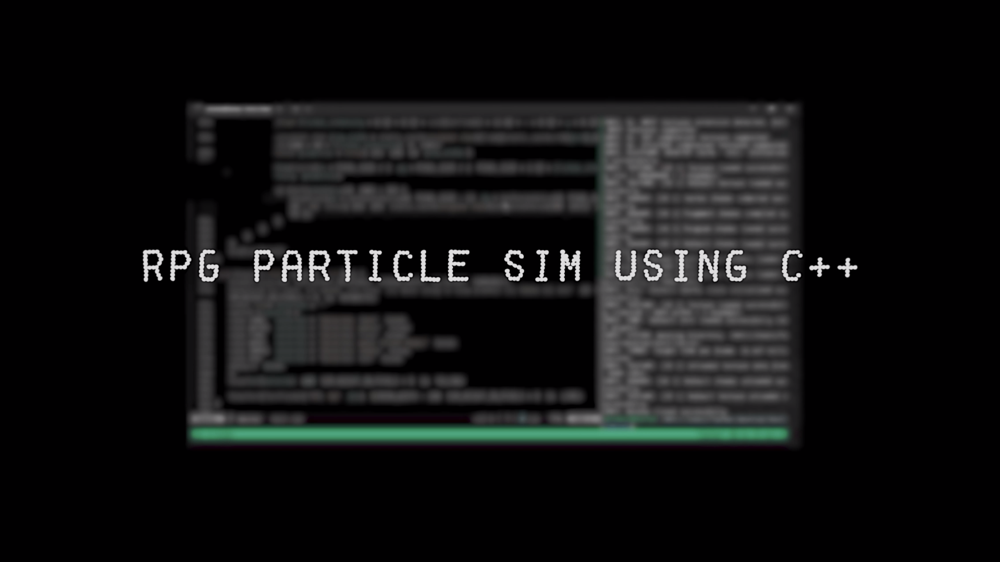

# 🎮 Pixel RPG Particle Simulator  
*A tiny, GPU-light sandbox where fire, water, sand and wood come to life in 2-D pixels.*

[](https://youtu.be/1eVuMJeRuXU)
---

## 🚀 What it Does
| Element | Behavior |
|---------|----------|
| **Sand** | Falls & stacks, can displace water |
| **Water** | Flows horizontally, puts out fire |
| **Fire** | Spreads to wood → leaves smoke & ash |
| **Wood** | Solid, flammable |
| **Smoke** | Rises and fades |
| **Ash**  | Light residue from burnt sand |

### ✨ Extra Polish
- Flickering flames & glowing embers  
- Subtle color variations for a “hand-drawn” feel  
- On-screen FPS counter  
- Brush & line tools for instant creativity

---

## 🛠️ Build & Run
### Prerequisites
- C++17 compiler (GCC, Clang, MSVC)  
- [Raylib 4.x](https://github.com/raysan5/raylib)

### Clone & Compile

# Particle Simulation

A sandbox-style particle simulator built with **C++** and **Raylib**.

---

### ⚙️ Requirements

* C++17 compiler (GCC, Clang, MSVC)
* [Raylib 4.x](https://github.com/raysan5/raylib)

---

### 🛠️ Clone & Compile

```bash
git clone https://github.com/artyviz/particle-simula.git
cd particle-simula
g++ main.cpp -std=c++17 -lraylib -lGL -lm -lpthread -ldl -lrt -lX11 -o pixel_sim
./pixel_sim
```

> ⚠️ **Windows & macOS users:** Refer to [Raylib’s platform-specific flags cheatsheet](https://github.com/raysan5/raylib/wiki/Working-on-multiple-platforms) for proper compilation setup.

---

### 🎮 Controls

| Key         | Action                                               |
| ----------- | ---------------------------------------------------- |
| 1–6         | Select element (Sand, Water, Fire, Wood, Smoke, Ash) |
| LMB         | Paint / draw planks                                  |
| Drag with 4 | Draw straight wood planks                            |
| C           | Clear canvas                                         |
| ESC         | Quit                                                 |

---

### 🧩 Code Map

* `main.cpp` – the whole show
* `enum Element` – particle types
* `struct Particle` – color, lifetime, etc.
* `UpdateSimulation()` – rule engine
* `DrawGrid()` & `DrawGlowAndEmbers()` – renderer + eye-candy

---

### 🤝 Contribute

Found a bug or want a new element?
Open an issue or send a pull request—**every pixel counts**!

---

### 🔑 License

MIT – feel free to fork & burn (virtual) forests. 🌲🔥
